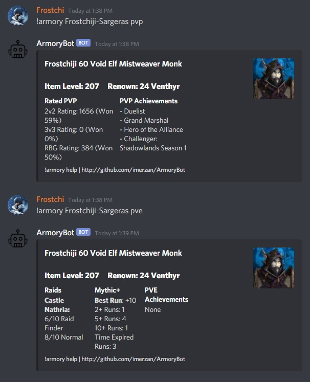

# ArmoryBot
.NET Core Discord Bot for World of Warcraft Armory Lookups.

## Current Status: Working in Shadowlands 9.x

### Setup:
1. Sign up for Blizzard API Access, and register an application at https://develop.battle.net/ , you will need a **client_id** and **client_secret**.
2. Register a new discord application at https://discord.com/developers/applications , subsequently create a "Bot" for your application, and take note of the **token** for your created bot.
3. On the Oauth2 page of your discord application, use the supplied URL to join your bot to your server(s). The URL should look like https://discord.com/api/oauth2/authorize?client_id=YOURCLIENTID&permissions=281600&scope=bot   where YOURCLIENTID is the id listed on the "General Information" page.
4. Modify **blizzard.json** and **discord.json** with the above parameters that are bolded in parts 1 & 2.
5. Make sure you have .NET Core 3.1 or newer runtime installed on the system that will be running your bot (.NET Core is cross-platform so you can run this on Windows/macOS/Linux/x64/arm/etc.) https://dotnet.microsoft.com/download
6. Launch the application. The bot should come online and respond to requests. See usage below.

**macOS/Linux:** When running from bash terminal, use the following commands:
```
chmod 755 ArmoryBot
./ArmoryBot
```
**NOTE:** When reporting issues with the bot, please utilize https://github.com/imerzan/ArmoryBot/issues , and include any debug/exception info from your console window.

### Usage:
```!armory character-realm pve/pvp```

example: ```!armory Frostchiji-Sargeras pvp``` **NOTE:** Spaces in realm name should have a ' - ' character (ex: Wyrmrest-Accord)


